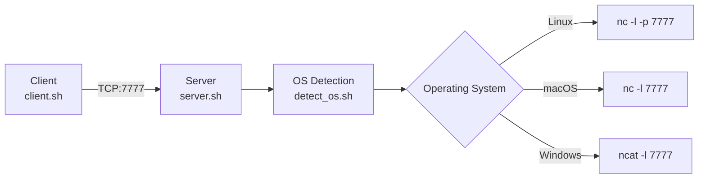

# [0] TCP Server & Client - Bash | cchopin

A cross-platform TCP server and client implementation using bash and netcat for receiving and sending messages.

## Project overview

This project implements a basic TCP communication system with:
- **Server**: Listens on port 7777 and receives messages
- **Client**: Connects to server and sends messages
- **Cross-platform support**: Linux, macOS, and Windows compatibility
- **OS detection**: Automatic detection and adaptation to different operating systems

## Learning objectives

- Understanding TCP client-server communication
- Cross-platform bash scripting
- Process handling and OS detection
- Network programming fundamentals
- Basic security considerations in network applications

## Architecture



## File structure

```
project/
├── server.sh          # TCP server implementation
├── client.sh          # TCP client implementation
├── detect_os.sh       # Cross-platform OS detection
└── README.md          # This documentation
```

## Prerequisites

### Linux/macOS
```bash
# Usually pre-installed, but if needed:
sudo apt install netcat-openbsd  # Ubuntu/Debian
brew install netcat              # macOS with Homebrew
```

### Windows
```bash
# Option 1: Chocolatey
choco install netcat

# Option 2: Download ncat from nmap.org
# https://nmap.org/download.html

# Option 3: WSL (Windows Subsystem for Linux)
wsl sudo apt install netcat-openbsd
```

## Usage

### Make scripts executable
```bash
chmod +x server.sh client.sh detect_os.sh
```

### Start the server
```bash
./server.sh
```
Expected output:
```
OS detected: Linux
Starting server on Linux...
Listening on port 7777...
```

### Run the client (make sure to be in another terminal)
```bash
./client.sh
```
Example interaction:
```
Enter the server address [localhost]:
Enter the message: Hello from client!
Sending message to localhost...
```

### Server receives the message
```
Message received: Hello from client!
Connection closed, restarting server...
```

## Features

### Cross platform OS detection
The `detect_os.sh` script automatically detects:
- **Linux**: Uses `nc -l -p 7777`
- **macOS**: Uses `nc -l 7777`
- **Windows**: Tries `ncat` first, falls back to `nc` variants

### Client features
- **Default server**: Uses `localhost` as default (just press Enter)
- **Custom server**: Specify IP address or hostname
- **Input validation**: Handles empty inputs gracefully

### Server features
- **OS-specific**: Adapts netcat syntax based on detected OS
- **Error handling**: Graceful handling of missing netcat installations

## Code explanation

### OS detection logic
```bash
detect_os() {
    case "$(uname -s)" in
        Linux*)   os_type="Linux" ;;
        Darwin*)  os_type="macOS" ;;
        CYGWIN*|MINGW32*|MSYS*|MINGW*) os_type="Windows" ;;
        *)        os_type="Unknown" ;;
    esac
    export DETECTED_OS="$os_type"
}
```

### Default value handling
```bash
# If user presses Enter, use localhost
server_address=${server_address:-$default_server}
```

### Cross platform netcat
```bash
case "$DETECTED_OS" in
    "Linux")   nc -l -p 7777 ;;
    "macOS")   nc -l 7777 ;;
    "Windows") ncat -l 7777 || nc -l 7777 ;;
esac
```

## Testing

### Test basic communication
```bash
# Terminal 1
./server.sh

# Terminal 2
./client.sh
# Enter: localhost
# Message: "Test message"
```

### Test remote connection
```bash
# On server machine
./server.sh

# On client machine (replace with server IP)
./client.sh
# Enter: 192.168.1.100
# Message: "Remote test"
```
## Troubleshooting

### Server won't start
```bash
# Check if port is in use
netstat -tulpn | grep 7777

# Kill existing process
sudo killall nc
```

### Client can't connect
```bash
# Test connectivity
ping server_address
telnet server_address 7777
```

### Netcat not found (Windows)
```bash
# Install options
choco install netcat                    # Chocolatey
winget install nmap                     # Windows Package Manager
# Or download from https://nmap.org/
```

## Contributing

Feel free to submit issues and enhancement requests!
