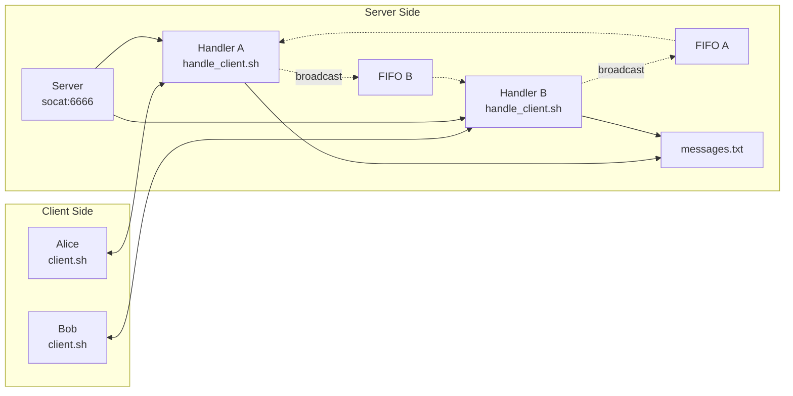

# TCP Bash Chat Server

A lightweight, real-time multi-client chat server built entirely in Bash using TCP sockets and FIFOs for inter-process communication.

**Note: This project has been tested exclusively on macOS. Compatibility with other Unix-like systems is expected but not verified.**

## Table of contents

- [Features](#features)
- [Prerequisites](#prerequisites)
- [Installation](#installation)
- [Usage](#usage)
- [Architecture](#architecture)
- [File structure](#file-structure)
- [Technical details](#technical-details)
- [Troubleshooting](#troubleshooting)
- [Contributing](#contributing)

## Features

- **Multi-client support**: Multiple users can connect simultaneously
- **Real-time messaging**: Instant message delivery between clients
- **Clean interface**: "You:" vs "username:" message formatting
- **Message logging**: All messages saved to `messages.txt`
- **Graceful disconnection**: Proper cleanup when clients disconnect
- **No external dependencies**: Pure Bash implementation (except `socat`)
- **Tested on macOS**: Verified functionality on macOS systems

## Prerequisites

- **Bash 4.0+**: Modern Bash shell
- **socat**: For TCP socket handling
- **macOS**: Primary tested platform (other Unix-like systems may work)

### Installing socat

**macOS (using Homebrew):**
```bash
brew install socat
```

**Ubuntu/Debian (untested):**
```bash
sudo apt-get install socat
```

**CentOS/RHEL (untested):**
```bash
sudo yum install socat
```

## Installation

1. **Clone or download the project files:**
```bash
git clone <repository-url>
cd tcp-bash-chat-server
```

2. **Make scripts executable:**
```bash
chmod +x server.sh handle_client.sh client.sh
```

3. **Verify socat installation:**
```bash
socat -V
```

## Usage

### Starting the server

Open a terminal and run:
```bash
./server.sh
```

You should see:
```
Starting chat server on port 6666...
Messages will be logged to messages.txt
Press Ctrl+C to stop server
```

### Connecting clients

In separate terminals, connect clients:
```bash
./client.sh
```

Each client will prompt for a username:
```
Enter your username: alice
=== Chat connected ===
Type your messages and press Enter
Ctrl+C to quit

[SYSTEM] Welcome! Your ID: client_12345
[SYSTEM] Enter your username:
[SYSTEM] Connected as alice
```

### Chatting

Once connected, simply type messages and press Enter:

**Client 1 (alice):**
```
hello everyone!
You: hello everyone!
bob: hey alice!
```

**Client 2 (bob):**
```
alice: hello everyone!
hey alice!
You: hey alice!
```

### Disconnecting

Press `Ctrl+C` in any client to disconnect gracefully.

## Architecture

### Overview

The chat system uses a **hub-and-spoke** architecture where:

1. **Server** (`socat`) listens on port 6666
2. **Handler** (`handle_client.sh`) manages each client connection
3. **FIFOs** enable message broadcasting between clients
4. **Client** (`client.sh`) provides the user interface

### Message flow

```
Client A → Handler A → FIFO B → Handler B → Client B
         ↓
    messages.txt (log)
```

### System architecture diagram



### Process structure

```
server.sh
├── socat (port 6666)
│   ├── handle_client.sh (Client 1)
│   │   ├── message processor
│   │   └── FIFO listener
│   ├── handle_client.sh (Client 2)
│   │   ├── message processor
│   │   └── FIFO listener
│   └── ...
```

## File structure

```
tcp-bash-chat-server/
├── server.sh              # Main server script
├── handle_client.sh       # Client connection handler
├── client.sh              # Chat client
├── messages.txt           # Message log (created automatically)
├── README.md              # This file
└── /tmp/                  # Temporary files (auto-managed)
    ├── connected_clients.txt
    └── client_*_fifo
```

### File descriptions

- **`server.sh`**: Main server that accepts connections
- **`handle_client.sh`**: Handles individual client sessions and message broadcasting
- **`client.sh`**: User-facing chat client with formatted interface
- **`messages.txt`**: Persistent log of all chat messages
- **`/tmp/connected_clients.txt`**: Active client registry
- **`/tmp/client_*_fifo`**: Named pipes for inter-client communication

## Technical details

### Protocol format

The system uses a simple text-based protocol:

- **`SYSTEM:message`**: System notifications
- **`CONFIRM:message`**: Confirmation of sent message
- **`BROADCAST:user: message`**: Message from another user

### Connection handling

1. Client connects via TCP to port 6666
2. Server forks `handle_client.sh` process
3. Client provides username
4. Handler creates FIFO for message reception
5. Client registered in `/tmp/connected_clients.txt`
6. Message loop begins

### Message broadcasting

When a client sends a message:

1. Handler receives message via stdin
2. Sends `CONFIRM:message` back to sender
3. Logs message to `messages.txt`
4. Broadcasts to all other clients via their FIFOs
5. Other clients display the message

### Cleanup process

On disconnection:
- Handler kills background processes
- Removes client FIFO
- Updates connected clients list
- Client closes TCP connection

## Troubleshooting

### Common issues

**Server won't start:**
```bash
# Check if port is already in use
lsof -i :6666

# Kill existing processes
pkill -f socat
```

**Clients see duplicate messages:**
```bash
# Clean up old temporary files
rm -f /tmp/connected_clients.txt /tmp/client_*_fifo
./server.sh
```

**Client can't connect:**
```bash
# Verify server is running
ps aux | grep socat

# Check network connectivity
nc localhost 6666
```

**Messages not appearing:**
```bash
# Check FIFO permissions
ls -la /tmp/client_*_fifo

# Verify client processes
ps aux | grep handle_client
```

### Debug mode

Add debug logging to `handle_client.sh`:
```bash
# Add after line 1:
exec 4>>/tmp/debug_$.log
echo "$(date): Client $CLIENT_ID action" >&4
```

### Performance considerations

- **Concurrent clients**: Tested with 10+ simultaneous users on macOS
- **Message throughput**: Handles hundreds of messages per minute
- **Memory usage**: Each client uses ~2-5MB RAM
- **File descriptors**: Monitor with `lsof` under heavy load

## Contributing

### Development setup

1. Fork the repository
2. Create a feature branch
3. Test thoroughly with multiple clients on macOS
4. Submit a pull request

### Testing

**Basic functionality:**
```bash
# Terminal 1
./server.sh

# Terminal 2
./client.sh

# Terminal 3
./client.sh
```

**Stress testing:**
```bash
# Start multiple clients
for i in {1..5}; do
    open -a Terminal.app -- bash -c "cd $(pwd) && ./client.sh"
done
```

### Code style

- Use 4-space indentation
- Comment complex logic
- Keep functions under 50 lines
- Follow existing naming conventions

## Acknowledgments

- Built using standard Unix tools
- Inspired by IRC and other chat protocols
- Thanks to the Bash and socat communities
- Developed and tested on macOS

---

**Happy chatting!**
